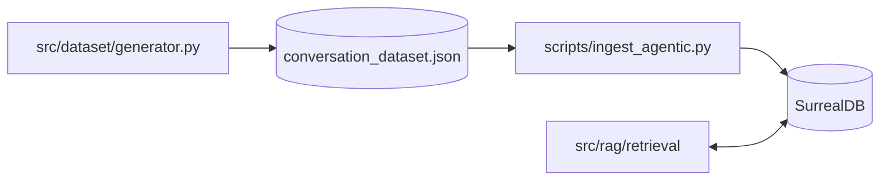
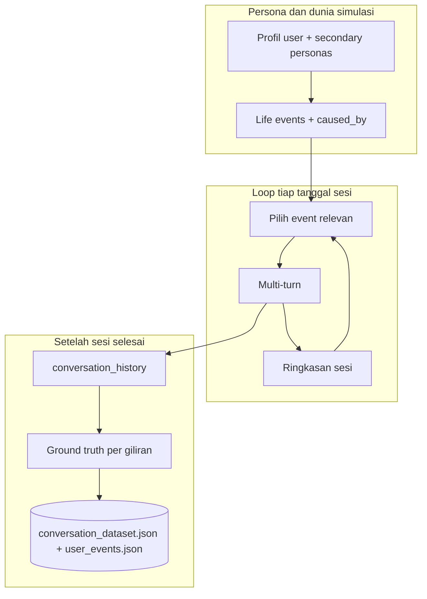
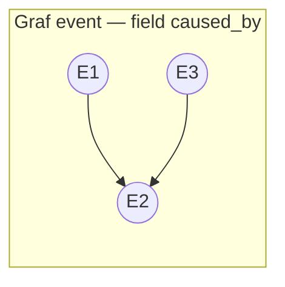
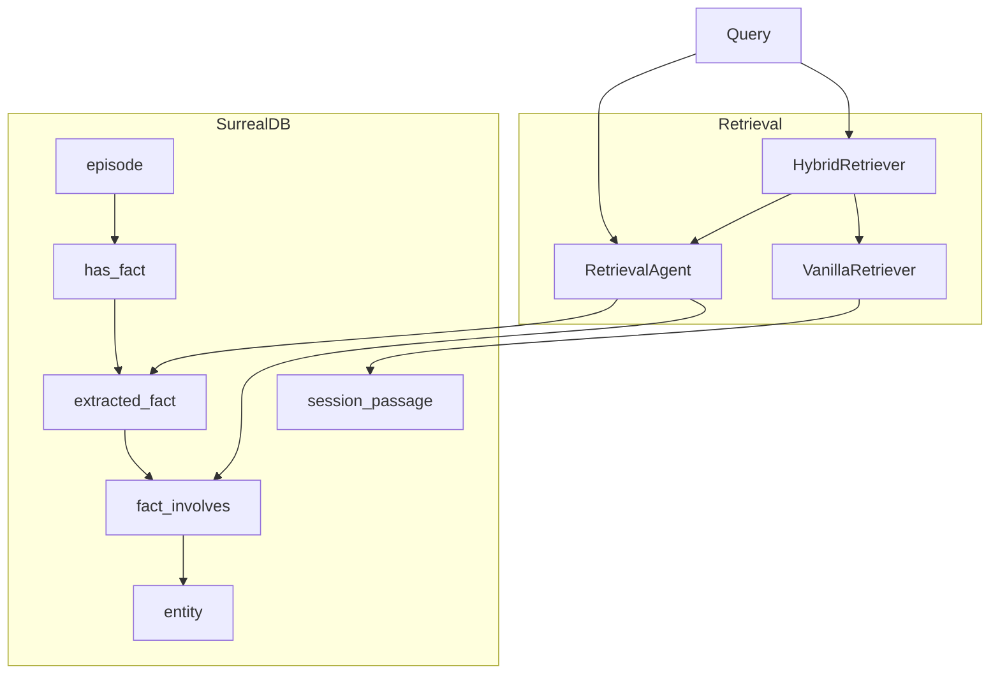
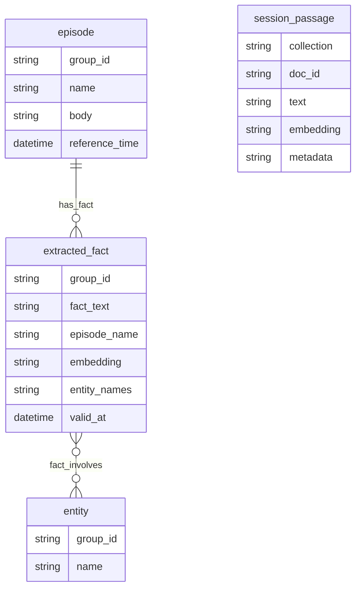

# Tempograph

<p align="center">
  
</p>

**Agentic RAG with a temporal fact graph for Indonesian long-context chatbots**

Sistem RAG agentic di atas **SurrealDB**: graf temporal (episode → fakta → entitas), pencarian vektor pada fakta dan pada passage sesi, serta jalur **vanilla**, **agentic**, dan **hybrid**. Dataset longitudinal berbahasa Indonesia dapat dihasilkan dengan pipeline terpisah lalu di-ingest ke basis yang sama.

---

## Ringkasan

| Bagian | Peran |
|--------|--------|
| **Dataset** | `src/dataset/generator.py` — persona, graf event (`caused_by`), sesi multi-turn, ringkasan sesi, anotasi ground truth per giliran. |
| **RAG** | Ingest `scripts/ingest_agentic.py` → SurrealDB (`schema.surql`, 768-dim cosine). Evaluasi `scripts/evaluate_agentic.py` / `scripts/evaluate_vanilla.py`. |

Contoh data siap pakai ada di **`output/example_dataset/`** (`conversation_dataset.json`, `evaluation_queries_100.json`, dll.) sehingga alur Surreal dapat diuji tanpa menjalankan generator.

---

## Arsitektur

### Alur end-to-end



### Pipeline dataset

**Entri:** `src/dataset/generator.py` — `parse_args()`, `main()`. Membutuhkan **Google Gemini** (`GEMINI_API_KEY`).

1. **Persona** — file `--user-file` atau `--auto-generate-persona`.
2. **Life events** — daftar event bertanggal dengan **`caused_by`**; disimpan ke **`user_events.json`** di `--out-dir`.
3. **Sesi** — per tanggal sesi: `get_relevant_events` → `generate_conversation_session` → `generate_session_summary`; ringkasan kumulatif mengisi konteks berikutnya. Opsional **`--use-caching`** (context cache pada model dialog).
4. **Ground truth** — `generate_ground_truth_annotations`: per giliran `generate_ground_truth_for_turn`; mode inkremental memanggil `resolve_ground_truth_conflicts`. Keluaran utama: **`conversation_dataset.json`**.

Model Gemini per tahap dikonfigurasi lewat **variabel lingkungan** (lihat [Konfigurasi](#konfigurasi)); default mengikuti tier *structured* / *dialog* / *light* yang dipetakan di `.env.example`.





### Ingest dan retrieval (SurrealDB)

**Ingest:** `scripts/ingest_agentic.py` — menulis episode, `extracted_fact`, `entity`, relasi **`has_fact`** / **`fact_involves`**, serta **`session_passage`** (vektor per sesi penuh untuk vanilla/hybrid). Skema dan indeks vektor: **`src/rag/surreal/schema.surql`**.

**Skrip evaluasi:** `scripts/evaluate_agentic.py`, `scripts/evaluate_vanilla.py`, `scripts/test_agentic_hybrid_top3_questions.py` (SurrealDB harus dapat dijangkau sesuai `.env`).





---

## Persyaratan

- Python 3.11+ (disarankan mengikuti `environment.example.yml`).
- **SurrealDB** untuk penyimpanan graf + vektor.
- **Gemini** untuk generator dataset dan untuk banyak jalur RAG (kunci + kuota).
- **Novita** (opsional): dipakai bila `LLM_PROVIDER=novita` untuk ekstraksi fakta agentic; kunci di `.env` (`NOVITAAI_API_KEY`).

---

## Instalasi

```bash
git clone <URL-repositori>
cd <direktori-repo>

conda env create -f environment.example.yml
conda activate tempograph

uv pip install -U -r requirements.txt

cp .env.example .env
# Isi GEMINI_API_KEY, SURREAL_*, dan bagian lain sesuai tabel di bawah.
```

Cek koneksi Surreal (dari root repo):

```bash
python scripts/run_with_local_surreal.py -- python scripts/test_surreal_connection.py
```

`run_with_local_surreal.py` dapat menjalankan proses Surreal lokal bila dikonfigurasi; lihat `--help` pada skrip tersebut.

---

## Konfigurasi

Salin `.env.example` ke `.env`. Ringkasan variabel penting:

### API dan penyedia

| Variabel | Keterangan |
|----------|------------|
| `GEMINI_API_KEY` | Wajib untuk generator dataset dan stack yang memakai Gemini. |
| `NOVITAAI_API_KEY` | Untuk `LLM_PROVIDER=novita` pada RAG agentic (OpenAI-compatible). |

### Stack RAG terpusat (`--setup env`)

Ingest dan evaluasi dapat memakai satu set variabel tanpa mengganti kode:

| Variabel | Nilai umum | Fungsi |
|----------|------------|--------|
| `LLM_PROVIDER` | `gemini` / `novita` | Ekstraksi fakta agentic (`gemini` = GenAI; `novita` = endpoint Novita). |
| `LLM_MODEL` | kosong = default per provider | ID model mengikuti provider. |
| `EMBED_PROVIDER` | `gemini` / `huggingface` | Embedding untuk fakta dan `session_passage`. |
| `EMBED_MODEL` | kosong = default per provider | ID model embedding. |
| `RAG_GROUP_ID` | mis. `agentic_default` | Partisi graf Surreal (`group_id`). |
| `RAG_SESSION_COLLECTION` | mis. `vanilla_default` | Nama koleksi logis untuk vektor passage sesi (vanilla / kaki vanilla hybrid). |
| `RAG_MODE` | `agentic` / `vanilla` / `hybrid` | Hanya dipakai dengan `python scripts/evaluate_agentic.py --setup env`. |

**Ingest dari env:** `python scripts/ingest_agentic.py --setup env` — `RAG_GROUP_ID` dan `RAG_SESSION_COLLECTION` harus konsisten dengan evaluasi nanti.

**Eval dari env:** `python scripts/evaluate_agentic.py --setup env` — atur `RAG_MODE` sesuai jalur yang diuji.

Preset tetap tersedia: `--setup gemini`, `gemma`, `gemini_hybrid`, `gemma_hybrid`, `vanilla_gemini`, `vanilla_gemma`, serta `ingest_agentic.py --setup gemini|gemma|all`.

### Model generator dataset (Gemini)

Tiga ID model terpisah (semua lewat API Gemini):

| Variabel | Peran dalam `generator.py` |
|----------|-----------------------------|
| `DATASET_GEMINI_MODEL_STRUCTURED` | Persona, life events, kelanjutan event (keluaran JSON terstruktur). |
| `DATASET_GEMINI_MODEL_DIALOG` | Sesi multi-turn; target model untuk context caching bila `--use-caching`. |
| `DATASET_GEMINI_MODEL_LIGHT` | Ringkasan sesi, ground truth per giliran, resolusi konflik fakta. |

Default mengacu ke nilai di `.env.example` bila variabel dikosongkan.

### SurrealDB

| Variabel | Keterangan |
|----------|------------|
| `SURREAL_URL` | Mis. `ws://127.0.0.1:8000` (tanpa `/rpc`; ditangani SDK). |
| `SURREAL_USER` / `SURREAL_PASS` | Otentikasi root atau pengguna terbatas. |
| `SURREAL_NS` / `SURREAL_DB` | Namespace dan database. |

Parameter lanjutan (path CLI, opsi storage lokal) ada di `.env.example`.

### Parameter lain

`src/config/settings.py` menggabungkan rate limit, retrieval, dan evaluasi; nilai dapat diisi dari lingkungan sesuai definisi dataclass di file tersebut.

---

## Operasi harian

### 1. Generate dataset

```bash
python src/dataset/generator.py \
  --out-dir ./data/dataset \
  --num-sessions 10 \
  --num-events 20 \
  --num-days 60
```

Opsi berguna: `--auto-generate-persona`, `--fresh-start`, `--use-caching`, `--min-turns-per-session` / `--max-turns-per-session`.

### 2. Ingest ke SurrealDB

**Satu stack dari `.env`:**

```bash
python scripts/run_with_local_surreal.py --no-start -- \
  python scripts/ingest_agentic.py --setup env --limit 10 --batch 10
```

**Preset:**

```bash
python scripts/run_with_local_surreal.py --no-start -- \
  python scripts/ingest_agentic.py --setup gemini --limit 10 --batch 10
```

`--clear` menghapus data sesuai `RAG_GROUP_ID` + `RAG_SESSION_COLLECTION` (mode `env`) atau preset yang dipilih.

### 3. Evaluasi

**Agentic / vanilla / hybrid lewat env:**

```bash
python scripts/run_with_local_surreal.py --no-start -- \
  python scripts/evaluate_agentic.py --setup env --limit 5 --no-llm-judge
```

**Preset:**

```bash
python scripts/run_with_local_surreal.py --no-start -- \
  python scripts/evaluate_agentic.py --setup gemini --limit 5 --no-llm-judge
```

Query evaluasi default membaca `output/example_dataset/evaluation_queries_100.json`; hasil ditulis ke `output/evaluation_results/`.

---

## Struktur repositori

```
├── src/
│   ├── config/              # settings, experiment_setups, runtime_setup (env RAG), dataset_generation_env
│   ├── dataset/             # generator.py
│   ├── rag/
│   │   ├── ingestion/
│   │   ├── retrieval/       # agent, vanilla, hybrid
│   │   ├── surreal/         # koneksi, schema, fact graph, vanilla store
│   │   └── vectordb/
│   ├── llm/
│   ├── embedders/
│   ├── evaluation/
│   └── utils/               # Gemini helpers, cost tracker, dll.
├── scripts/
├── data/
├── output/
│   ├── example_dataset/
│   └── evaluation_results/
└── tests/
```

---

## Evaluasi (metrik skrip)

Skrip evaluasi mengukur antara lain:

- **Hit rate / MRR** terhadap sesi relevan yang diharapkan di file query.
- **Waktu retrieval** per query.
- **Context sufficiency** (opsional): penilaian dengan LLM judge — secara default memakai model Gemini (`--judge-model`), bukan GPT.

Rincian perhitungan ada di `scripts/evaluate_agentic.py` dan modul `src/evaluation/`.

---

## Referensi

- Inspirasi struktur longitudinal: [LOCOMO](https://github.com/ServiceNow/LOCOMO).
- Penyimpanan temporal + vektor: **SurrealDB** (skema di repo).
- Model bahasa: **Google Gemini** (dataset + mayoritas jalur RAG); **Novita** untuk jalur ekstraksi OpenAI-compatible.

## Lisensi

MIT License
